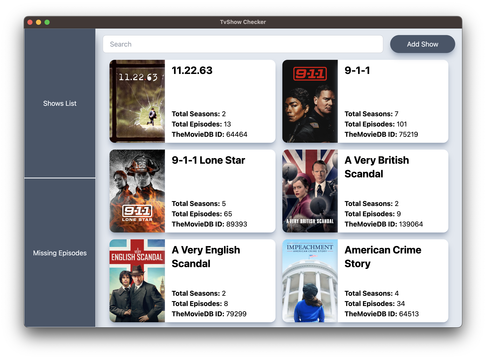
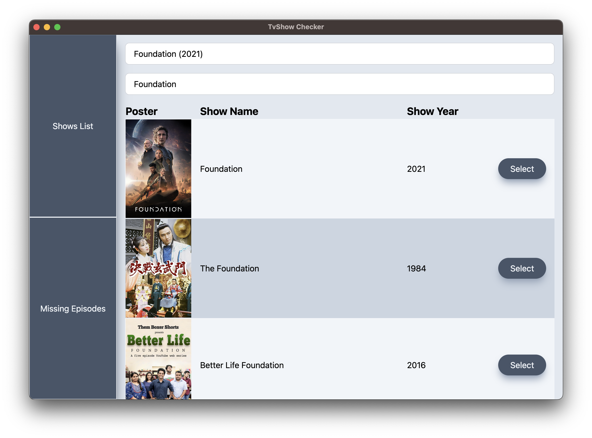
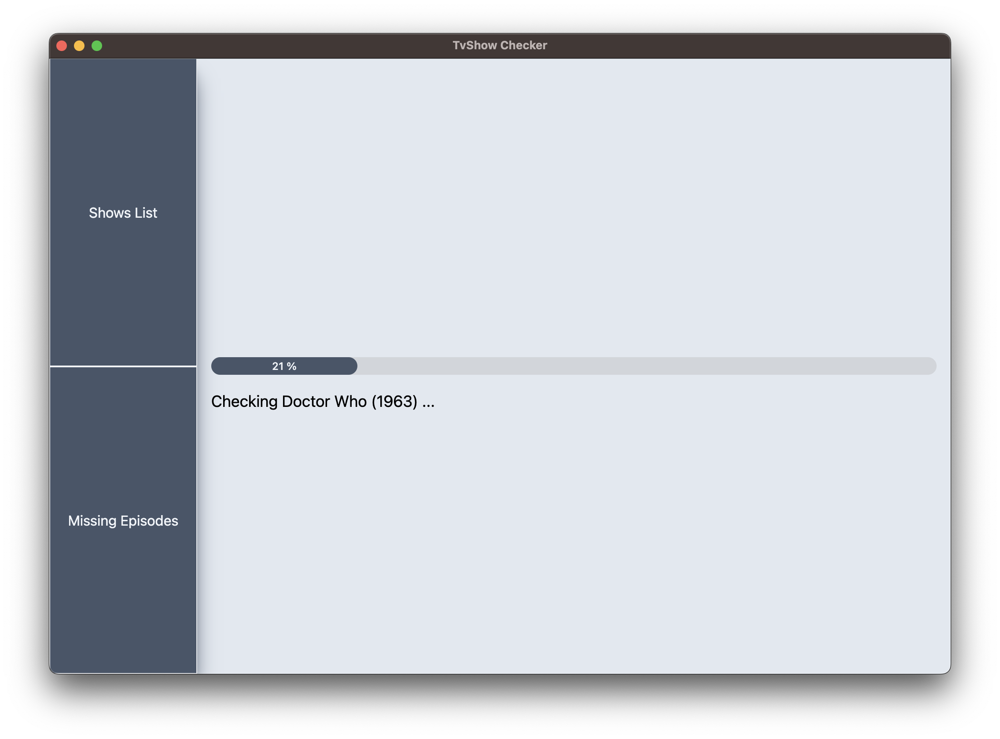
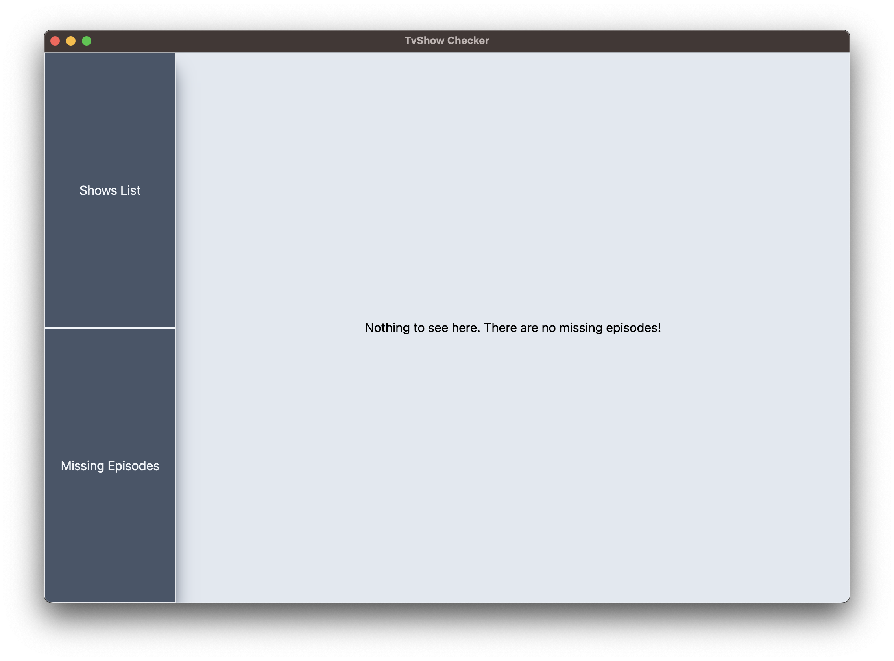
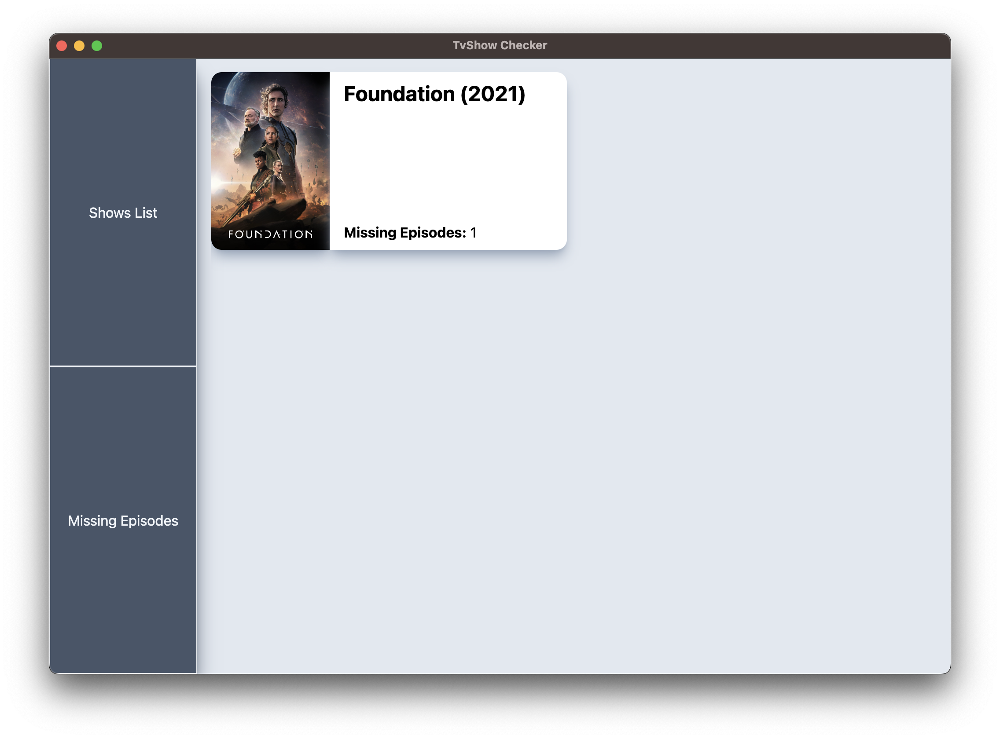

Custom Electron App made with the Electron React Boilerplate.

I have added TailwindCSS for the styling of components.

The app calls the API from TheMovieDB and a custom webservice I have made to check if my collection of Tv Shows is missing one or more episodes.

Here are some screenshot:

#### Main page

#### Add Show page

#### Missing Episodes page

